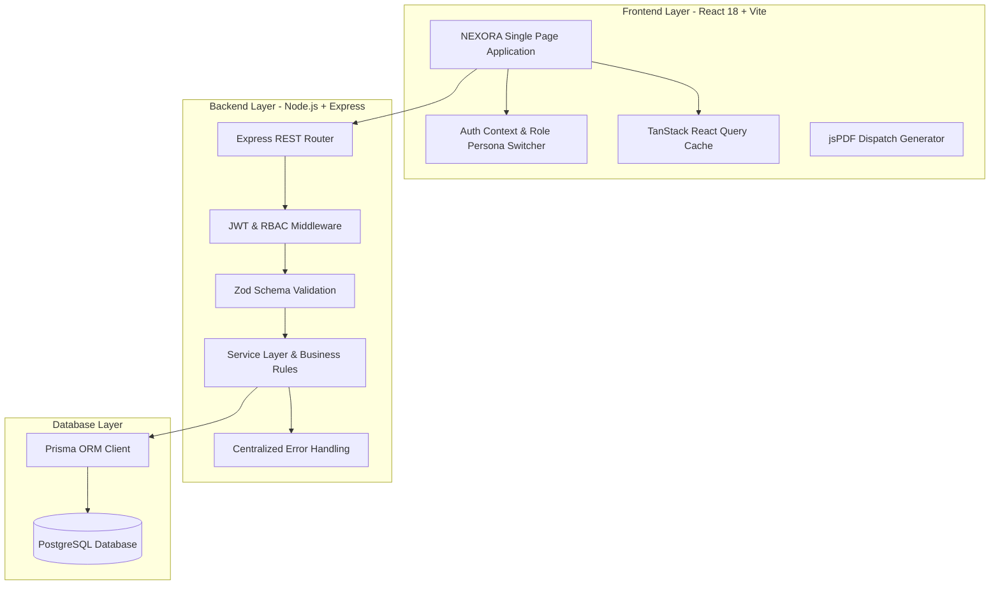
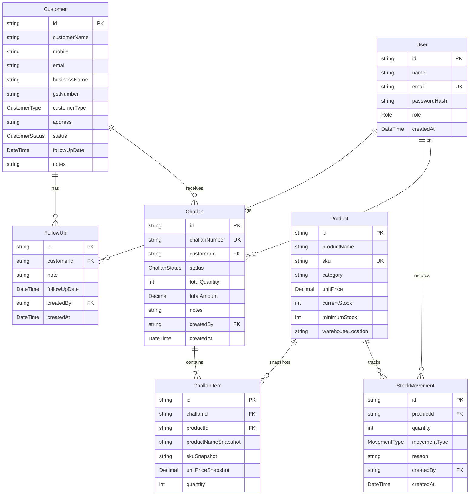

# NEXORA — Mini ERP + CRM Operations Portal

> **NEXORA — Operations & Customer Management**  
> A production-grade, full-stack Mini ERP and CRM Operations Portal engineered for wholesale distribution, industrial supply chains, and high-velocity commerce.

---

## 📌 Project Overview

**NEXORA** unifies **Customer Relationship Management (CRM)**, **Warehouse Inventory Auditing**, and **Delivery Challan ERP Workflows** into a single cohesive platform. Built with a modern, high-performance tech stack, NEXORA ensures strict atomic stock validation, prevents negative inventory, preserves historical product snapshot data, and provides real-time operational telemetry.

---

## ✨ Key Features

### 🔐 Authentication & Role-Based Access Control (RBAC)
- **JWT-based secure session management** with protected Express API routes.
- **4 Granular User Roles**:
  - `ADMIN`: Unrestricted global system access across all modules.
  - `SALES`: Customer management, CRM interaction logs, Challan creation, and dispatch confirmation.
  - `WAREHOUSE`: Inventory catalog management, low-stock reorder alerts, and manual inventory adjustments (`+IN` / `-OUT`).
  - `ACCOUNTS`: Read-only access to customer ledgers, financial summaries, and delivery challans.
- **Demo Persona Quick-Switcher**: 1-click login and on-the-fly role testing in development.
- **Secure Password Hashing**: Utilizes `bcryptjs` with 10 salt rounds.

### 👥 Customer CRM Module
- Comprehensive B2B customer directory with GSTIN registration, contact coordinates, and segment classification (`RETAIL`, `WHOLESALE`, `DISTRIBUTOR`).
- Real-time search by customer name, business entity, phone, or email.
- Account status tracking (`LEAD`, `ACTIVE`, `INACTIVE`).
- **Interactive CRM Follow-Up Activity Log**: Chronological timeline of sales conversations and scheduled next-touch dates with automated reminders.
- **Client-side Form Validation**: Powered by React Hook Form + Zod with inline error rendering.

### 📦 Product & Inventory Catalog
- Real-time stock status monitoring with automated health indicators:
  - `In Stock`: Current stock > Minimum stock threshold.
  - `Low Stock Alert`: Current stock $\le$ Minimum stock threshold.
  - `Out of Stock`: Current stock $\le 0$.
- Storage bin and warehouse rack indexing (e.g. `Bay A, Rack 02-B`).
- Filters for product category, stock health status, and SKU search.
- Referential integrity safeguards preventing deletion of catalog items linked to historical challans.

### 🔄 Warehouse Stock Movements & Audit Ledger
- Immutable, append-only historical audit trail for every inventory change.
- Directional indicator badges for **Stock Inflow (`+IN`)** and **Stock Outflow (`-OUT`)**.
- Manual stock reconciliation modal with real-time stock balance preview.
- Audit capture: product SKU, quantity, reason/reference (PO receipt, Challan dispatch, return), timestamp, and authoring staff member.

### 📑 Delivery Challan ERP & Dispatch Engine
- Multi-item line builder with live inventory availability checks and dynamic total amount calculations.
- **Challan Snapshot Pattern**: Freezes product name, SKU, and unit rate snapshot at the time of creation, ensuring historical records remain immutable even if catalog prices change later.
- **Atomic Stock Business Logic**:
  - **Draft Challans**: Can be created and modified without locking or deducting warehouse stock.
  - **Challan Confirmation**: Executes an atomic Prisma database transaction that checks stock levels across all line items. If any product is insufficient, the entire operation rolls back with a detailed error message. If valid, stock is decremented and `OUT` stock movements are logged automatically.
  - **Challan Cancellation**: If a confirmed challan is cancelled, deducted inventory is automatically restored back into the warehouse, and `IN` stock restoration movements are logged.
- **Sequential Challan Numbering**: Auto-generates unique identifiers in the format `CH-YYYY-XXXXX` (e.g. `CH-2026-00001`).
- **Enterprise PDF & Printing**: In-browser print stylesheet formatted for industrial dispatch + client-side PDF generation using `jsPDF` and `jspdf-autotable`.

### 📊 Executive Operations Dashboard
- Live KPI cards: Total Customers, Active Leads, Total Inventory Units, Low Stock Alert Count, Out of Stock Count, and Total Confirmed Challans.
- **Interactive Recharts Telemetry**:
  - *Area Chart*: Monthly confirmed revenue velocity vs draft pipelines.
  - *Donut Chart*: Customer distribution across wholesale, distributor, and retail channels.
- **Urgent Action Panels**: Critical low-stock reorder warnings, today's pending follow-ups with 1-click CRM view, and recent delivery challans list.

---

## 🛠️ Tech Stack

### Frontend
- **Framework**: React 18 with TypeScript
- **Build Tool**: Vite
- **Styling**: Tailwind CSS with custom enterprise design tokens
- **Routing**: React Router v7
- **Server State & Caching**: TanStack React Query v5
- **Form Handling**: React Hook Form
- **Schema Validation**: Zod
- **Icons**: Lucide React
- **Data Visualization**: Recharts
- **PDF Generation**: jsPDF & jspdf-autotable

### Backend
- **Runtime**: Node.js v20+ with TypeScript
- **Framework**: Express.js
- **ORM**: Prisma ORM
- **Database**: PostgreSQL (Local & Cloud Supported)
- **Authentication**: JSON Web Tokens (`jsonwebtoken`) & `bcryptjs`
- **Validation**: Zod (request body & query parameter parsing)
- **Security & Logging**: Helmet, CORS, Morgan

---

## 📐 System Architecture



---

## 🗄️ Database Schema & Models



---

## 📁 Repository Structure

```
FundsRoom Task/
├── backend/
│   ├── prisma/
│   │   ├── schema.prisma       # Normalized PostgreSQL schema with indexes
│   │   ├── seed.ts             # Primary database seed script
│   │   ├── seed-neon.ts        # Cloud database seed script
│   │   └── verify-neon.ts      # Database audit & verification script
│   ├── src/
│   │   ├── config/             # App configuration & Prisma singleton
│   │   ├── controllers/        # REST route controllers
│   │   ├── middleware/         # JWT auth, RBAC authorization, error handling, Zod validation
│   │   ├── routes/             # Express API routes
│   │   ├── services/           # Business logic, atomic transactions, snapshot calculations
│   │   ├── types/              # TypeScript interface definitions
│   │   ├── utils/              # Challan numbering, standard JSON response wrappers
│   │   ├── validators/         # Zod schemas for all endpoints
│   │   ├── app.ts              # Express application configuration
│   │   └── server.ts           # Server bootstrap and connection logger
│   ├── Dockerfile
│   └── package.json
│
├── frontend/
│   ├── public/
│   │   └── favicon.svg         # Clean brand icon
│   ├── src/
│   │   ├── components/
│   │   │   ├── challan/        # Printable challan layout and jsPDF generator
│   │   │   ├── common/         # Button, Badge, Card, Modal, Pagination, StatCard, EmptyState, ConfirmDialog
│   │   │   └── layout/         # Sidebar, Header with alerts, AppLayout wrapper
│   │   ├── context/            # AuthContext (RBAC) and ToastContext (Global notifications)
│   │   ├── pages/              # Login, Dashboard, Customers, CustomerDetail, Products, StockMovements, Challans, CreateChallan, ChallanDetail
│   │   ├── routes/             # AppRoutes with ProtectedRoute guards
│   │   ├── services/           # Axios/Fetch API client + mock engine fallback
│   │   ├── types/              # Frontend TypeScript definitions
│   │   ├── App.tsx             # Root Application Provider
│   │   ├── main.tsx            # DOM mount point
│   │   └── index.css           # Tailwind base styles and print utilities
│   ├── Dockerfile
│   ├── tailwind.config.js
│   ├── vite.config.ts
│   ├── vercel.json
│   └── package.json
│
├── postman/
│   ├── nexora_postman_collection.json   # Full API collection with sample payloads
│   └── nexora_postman_environment.json  # Environment variables template for Postman
│
├── .github/workflows/
│   └── ci.yml                  # GitHub Actions continuous integration pipeline
├── docker-compose.yml          # Full multi-container Docker compose definition
├── render.yaml                 # Render infrastructure deployment blueprint
└── README.md                   # Complete documentation
```

---

## ⚡ Quick Start Guide

### Prerequisites
- **Node.js**: v18.0.0 or higher (v20 LTS recommended)
- **npm**: v9.0.0 or higher
- **PostgreSQL**: PostgreSQL 14+ running locally or a cloud database instance.

### 1. Install Dependencies
```bash
npm run install:all
```

### 2. Generate Prisma Client & Apply Schema
```bash
npm run prisma:generate
npm run prisma:migrate
```

### 3. Seed Database with Realistic Demo Data
```bash
npm run seed
```

### 4. Run the Development Servers
Open two terminal windows:

**Terminal 1 — Backend API:**
```bash
npm run dev:backend
```
*(Runs at `http://localhost:5000`)*

**Terminal 2 — Frontend Application:**
```bash
npm run dev:frontend
```
*(Runs at `http://localhost:5173` or `http://localhost:5174`)*

---

## 👥 Demo User Personas

| Persona Role | Email Address | Password | Permissions & Scopes |
| :--- | :--- | :--- | :--- |
| **Administrator** | `admin@nexora.demo` | `Admin@123` | Universal access across CRM, Inventory, Stock, ERP Challans & Users |
| **Sales Head** | `sales@nexora.demo` | `Sales@123` | Customer CRM, Follow-up notes, Create and Confirm Delivery Challans |
| **Warehouse Ops** | `warehouse@nexora.demo` | `Warehouse@123` | Product Catalog, Low Stock Alerts, Manual Stock Movements (`IN`/`OUT`) |
| **Accounts Lead** | `accounts@nexora.demo` | `Accounts@123` | Read-only access to Challans, Revenue telemetry & Customer accounts |

---

## 📡 REST API Summary

All API responses follow standard JSON envelopes:

### Key Endpoints

| Module | Method | Endpoint | Description |
| :--- | :--- | :--- | :--- |
| **Auth** | `POST` | `/api/auth/login` | Authenticate user and receive JWT token |
| | `GET` | `/api/auth/me` | Get logged-in user profile & role |
| **Dashboard** | `GET` | `/api/dashboard` | Aggregated KPIs, charts, alerts, and recent feeds |
| **Customers** | `GET` | `/api/customers` | Paginated customer list with filters |
| | `POST` | `/api/customers` | Register new customer profile |
| | `GET` | `/api/customers/:id` | Get customer profile & challans history |
| | `PUT` | `/api/customers/:id` | Update customer coordinates / status |
| | `DELETE` | `/api/customers/:id` | Delete customer (Admin only) |
| | `GET` | `/api/customers/:id/follow-ups` | Get customer interaction history |
| | `POST` | `/api/customers/:id/follow-ups` | Log new CRM follow-up note & schedule |
| **Products** | `GET` | `/api/products` | Paginated product list with SKU search & category filter |
| | `GET` | `/api/products/low-stock` | Retrieve products below minimum reorder threshold |
| | `POST` | `/api/products` | Create catalog item |
| | `GET` | `/api/products/:id` | Get product details & recent stock logs |
| | `PUT` | `/api/products/:id` | Update product details & price |
| | `DELETE` | `/api/products/:id` | Delete product (Admin only) |
| **Stock** | `GET` | `/api/stock-movements` | Paginated audit log of IN/OUT movements |
| | `POST` | `/api/stock-movements` | Record manual stock adjustment |
| **Challans** | `GET` | `/api/challans` | List delivery challans with status filters |
| | `POST` | `/api/challans` | Create Challan (Draft or Confirm) |
| | `GET` | `/api/challans/:id` | Get Challan with snapshot items & customer info |
| | `PUT` | `/api/challans/:id` | Update draft challan line items |
| | `POST` | `/api/challans/:id/confirm` | Atomic stock validation & deduction |
| | `POST` | `/api/challans/:id/cancel` | Atomic cancellation & stock recovery |

---

## 📮 Postman Collection

A complete Postman collection is included in the `/postman` directory:
1. Open Postman $\rightarrow$ click **Import**.
2. Select `postman/nexora_postman_collection.json` and `postman/nexora_postman_environment.json`.
3. Execute `1. Login (Admin)` — the test script will automatically set the `{{token}}` variable for all subsequent requests.

---

## 🐳 Docker Deployment

To launch the entire monorepo using Docker:

```bash
docker compose up --build -d
```
- Frontend: `http://localhost:5173`
- Backend API: `http://localhost:5000`
- PostgreSQL: `localhost:5432`

---

## ⚖️ Assumptions & Business Rules

1. **Sequential Challan Numbering**: Challans follow the standard enterprise format `CH-YYYY-XXXXX`.
2. **Snapshot Integrity**: Once a delivery challan is confirmed, its snapshot unit price, SKU, and product name remain locked to guarantee auditing compliance.
3. **Currency & Locale**: All monetary values are presented in Indian Rupees (`₹` INR) with standard currency formatting.
